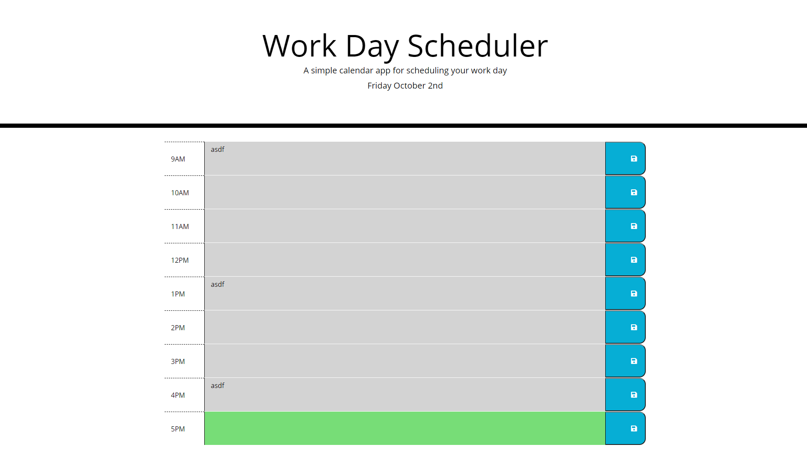

# work-scheduler

## Description

### Purpose

This site was made to make it easier for users to schedule out their day so that they can view their schedule throughout the day.  They are able to see a grid of the average work day hours and be able to write in what they are doing during each hour of the day.  They can save each entry by hitting the save button associated with that task.  The website also show which tasks they did in the past and which ones they will do in the future.
View webpage at (https://duncanmarten.github.io/work-scheduler/)

### Built with
* HTML
* CSS
* JavaScript

### APIs Used 
* Bootstrap
* JQuery
* Moments.js
* Google Fonts
* FontAwesome